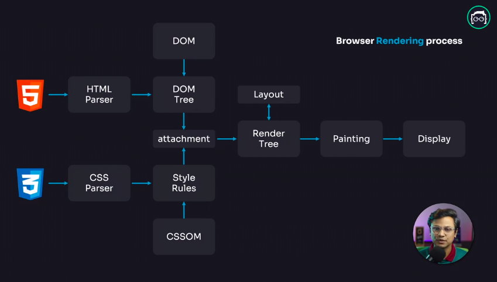
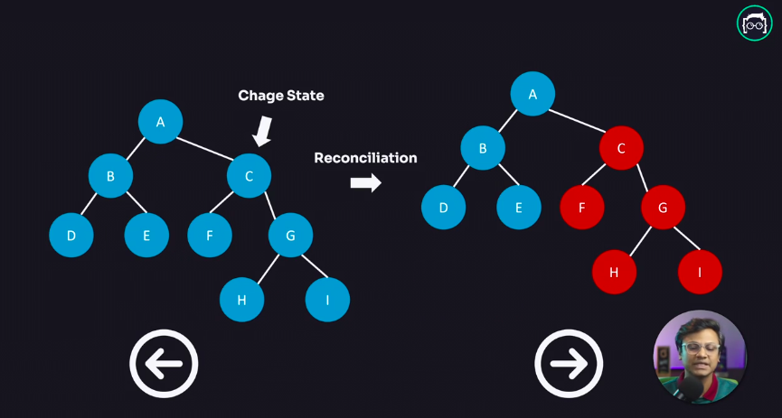

আলোচ্যসুচিঃ -

-   [রিয়াক্ট কি ? কেন আমরা রিয়াক্ট শিখবো ?](#রিয়াক্ট)
-   [ভার্চুয়াল ডম কি ? এটা কিভাবে কাজ করে ?](#ভার্চুয়াল)

**রিয়াক্ট কি ?**

রিয়াক্ট হলো একটি জাভাস্ক্রিপ্ট লাইব্রেরি যা জাভাস্ক্রিপ্ট ল্যাংগুয়েজ দিয়েই বানানো। এটি মূলত ওয়েব এবং নেটিব (মোবাইল) এপ্লিকেশনের ইউজার ইন্টারফেজ বানানোর জন্য তৈরি করা হয়েছে। ফেসবুকের একজন ইঞ্জিনিয়ার ,যার নাম হলো **JORDAN WALKE** সর্বপ্রথম ২০১১ সালে রিয়াক্টের একটা প্রোটোটাইপ তৈরি করেন যার নাম দেন FAX-JS । তারপর তা ২০১১ সালেই ফেসবুকের টাইমলাইনে ব্যাবহার করা হয় এবং ২০১২ সালে তা ইন্সটাগ্রামেও ব্যাবহার করা হয়। যেহেতু তারা অনেক ভালো রেজাল্ট পায় এতে তাই তারা সর্বপ্রথম ২০১৩ সালে এটিকে REACT JS নামে গিটহাবে ওপেনসোর্স হিসেবে সবার জন্য ফ্রি করে দেন ।

**কেন আমরা রিয়াক্ট শিখবো ?**

ভ্যানিলা জাভাস্ক্রিপ্টে আমরা যখন কোন প্রজেক্ট করি তখন সেখানে আমাদের কি করা লাগে ? যখন ইউজারের কোন একশনের কারণে UI তে কোন কিছু চেঞ্জ করা প্রয়োজন হয় তখন আমরা DOM MANIPULATION করি, এবং DOM এ কোন কাজ করার পর তা ম্যানুয়ালি আমারা UI তে আপডেট করে দেই। এইযে আমরা ইউজারের কোন একটা ইন্টারেকশনের কারণে বার বার DOM MANIPULATE করি এবং প্রতিবার ম্যানুয়ালি DOM UPDATE করি ,তখন এটা কিন্তু আমাদের কোড মেইন্টেন করাটা অনেক কঠিন হয়ে পড়ে। যদিও ছোট ছোট প্রজেক্টে হইতো দুই একটা ইন্টারেকশন থাকলে আমরা তা ম্যনুয়ালি আপডেট করে দিতে পারি ,কিন্তু ভাবুন আমাদের একটা এপ্লিকেশন আছে যাতে অনেক অনেক ইউজার ইন্টারেকশন আছে,তখন আমদের কি করা লাগবে?তখন আমাদের প্রতিবার ইউজারের যেকোনো ইন্টারেকশনে ম্যানুয়ালি DOM আপডেট করতে হবে । রিয়াক্ট আমাদের এইটার একটা সলিউশন দিয়ে দিয়েছে , যাতে ইউজারের কোন ইন্টারেকশনের কারণে আমাদের UI তে কোন চেঞ্জ করা লাগলেও যেন আমাদের সেটা বার বার ম্যানুয়ালি না করতে হয় । মূলত এই কারণেই রিয়াক্ট এর উৎপত্তি।

**রিয়াক্ট সেটা কিভাবে করে ?**

এটা রিয়াক্টের ফান্ডামেন্টাল কনসেপ্ট। রিয়াক্টের কাজের প্রসেসটাই এটা যে DOM এ কোন ইন্টারেকশন হলে সে নিজেই UI টা নতুন করে রেন্ডার করে দেয়। রিয়াক্ট এটা করে থাকে তার `Component` ও `state` এর মাধ্যমে ।

`Component` ও `state` কি তা আমরা পরের সেকশনে জানতে পারবো ।

**কেন আমরা রিয়াক্ট ব্যাবহার করবো ?**

---

**ভার্চুয়াল ডম কি ? এটা কিভাবে কাজ করে ?**

ভার্চুয়াল ডম কি তা জানার আগে চলুন জেনে আসি ডম কি জিনিস ?

আসলে আমরা ওয়েব এর জগতে যা দেখতে পাই ,তার সবকিছুই হলো DOM । ব্রাউজার সুধ্মমাত্র ডম কেই চিনে,ব্রাউজার জানেনা আপনি কোন প্রোগ্রামিং ল্যাংগুয়েজ দিয়ে কোড করছেন,সে জানেনা আপনি কোন লাইব্রেরি ব্যাবহার করছেন। সে শুধু চিনে ডম কে। সে যেই DOM TREE টা পায়, সেটাই আসলে স্ক্রীনে শো করে ।

**ব্রাউজার কিভাবে DOM রেন্ডার করে ?**

চলুন দেখি ব্রাউজার কিভাবে DOM কে রেন্ডার করায় । নিচের ছবিটা বুঝার চেষ্টা করুন,

আমরা দেখতে পাচ্ছি যে উপরে একটা গ্রাফ এর মাদ্ধমে ব্রাউজার এর রেন্ডারিং প্রসেস দেখানো হয়েছে । এখানে আমরা কি দেখতে পাচ্ছি ? আমরা দেখতে পাচ্ছি যে, যখন ব্রাউজার কোন HTML CSS ফাইল পায়,তখন সেই ফাইলটা একটা পারসিং এর মদ্ধে দিয়ে নিয়ে যায়, এক্ষেত্রে HTML এর জন্য HTML PARSER ও CSS এর জন্য CSS PERSER ব্যাবহার হয়। এসব পারসার দিয়ে পারসিং এর পর ব্রাউসার HTML দিয়ে একটা DOM TREE বানায় এর CSS দিয়ে CSSOM নামে একটা STYLE RULES বানায় , এবং DOM TREE ও STYLE RULES একসাথে ATTACH হয়ে একটা RENDER TREE বানায়। এই RENDER TREE ব্রাউসারে একটা LAYOUT ফেস এর মদ্ধে দিয়ে যায়। এই LAYOUT ফেস এ DOM TREE টা ব্রাউসার এর কোথায় রেন্ডার হবে তার একটা CORDINATE রেডি হয়ে যায় । এবং ফাইনালি ব্রাউজার তার PAINTING মেকানিজম এর মাদ্ধমে তা ব্রাউসারে পেইন্ট করে দেয় এবং আমরা ফাইনাল আউটপুট দেখতে পাই।

**DOM কি আসলেই স্লো?**

নাহ, ডম কখনোই স্লো না । আসলে যদি ভালোভাবে কোড করা হয় তাহলে ডম যেকোন কিছুর থেকে ফাস্ট। কিন্তু বর্তমান বিশ্বে ওয়েব অ্যাপ্লিকেশনগুলো অনেক বেশি ইন্টারেক্টিভ,তাই যখনই ইউজার কোন ইন্টারেকশন করে তখন ব্রাউজারকে আবার তা নতুন করে পুরো ওয়েবসাইটটা রি-পেইন্ট করতে হয়। এইরকম যখন অনেকগুলো রিয়াকশনের কারনে ব্রাউজারকে বার বার রি পেইন্ট করতে হয় তখন সেই রি-পেইন্টিং প্রসেসটা স্লো হয়ে যায়,মুলত ডম কিন্তু স্লো নয় ।

**ভার্চুয়াল ডম কি ? কিভাবে ভার্চুয়াল ডম কাজ করে?**

ভার্চুয়াল ডম রিয়াক্ট এর একটা ফান্ডামেন্টাল বিষয় । রিয়াক্ট এর ভিত্তিটাই মূলত এই ভার্চুয়াল ডম ।

ব্রাউজারের রি-পেন্টিং প্রসেসটা এপ্লিকেশনকে স্লো ডাউন করে দেয়, এই সমস্যা এড়ানোর জন্য আমরা কি করতে পারি ভাবুনতো। আমরা মূলত দুইটা ভাবে এটার সমাধান করতে পারি :

1.  আমরা ব্যাচ আপডেট করতে পারি
2.  আমরা ডম ম্যানুপুলেশন কম করতে পারি।

রিয়াক্ট তার ভার্চুয়াল ডমের মাদ্ধমে সেই কাজটাই করে । রিয়াক্ট একেবারে মিনিমাম ডম ম্যানুপুলেশন করে ।

যখন এপ্লিকেশনে কোন ইউজার কোন ইন্টারেকশন করে তখন যদি UI তে কোন চেঞ্জ করতে হয় তখন রিয়াক্ট সরাসরি HTML এর DOM TREE টাকে চেঞ্জ করে দেয়না। যখনি UI তে কোন চেঞ্জ আসে,রিয়াক্ট তার ভার্চুয়াল DOM এর সাহায্যে UI এর একটা রেপ্লিকা বা কপি বানিয়ে নেয় । তারপর রিয়াক্ট তার একটা নিজস্ব বানানো এলগরিদম `Diffng` বা `Reconciliation` এলগরিদম এর মাদ্ধমে চেক করে যে UI এর ঠিক কোন জায়গায় চেঞ্জ হয়েছে । এতে করে পুরো ওয়েবসাইটটা রি-রেন্ডার না করে শুধুমাত্র যেই অংশে পরিবর্তন হয়েচে,সেই অংশটুকু DOM এ আপডেট করে দেয়। এতে করে রিয়াক্ট মিনিমাম ডম অপারেশনের মাদ্ধমে এপ্লিকেশনএর পার্ফমেন্স ইম্প্রুভ করে ।

